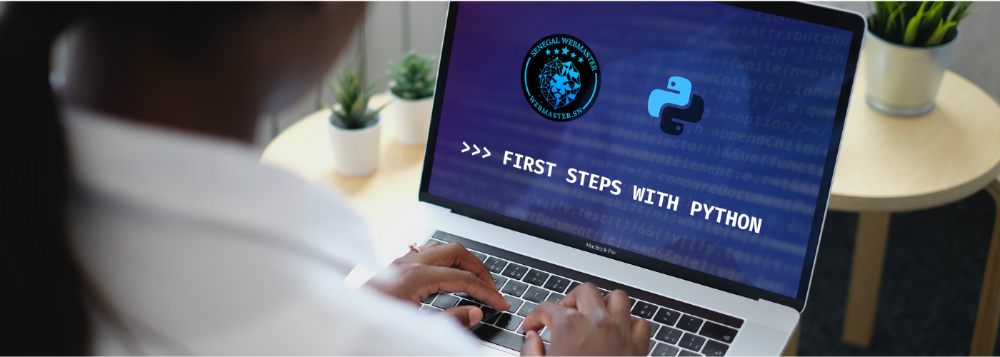

# First Steps With Python
This is a tutorial which try to give some basic knowledge on a new journey with python.
Any one can benefit from it and I'm, the author open to any suggestion in order to make that more profitable

## Outline
What you will find in this tutorial
* Description
* Bring up the interpreter
* Declaring a variable
* Print variables
* Numbers and Strings
* List, tuple and dictionary (**)

### Find this tutorial [here](https://jmndao.herokuapp.com/jCode/6128bccdb819d93418bbfc8e)
### Contact me [here](https://jmndao.herokuapp.com/contact) 

**(\**) Not yet available**

Thanks.
__Jonathan.__